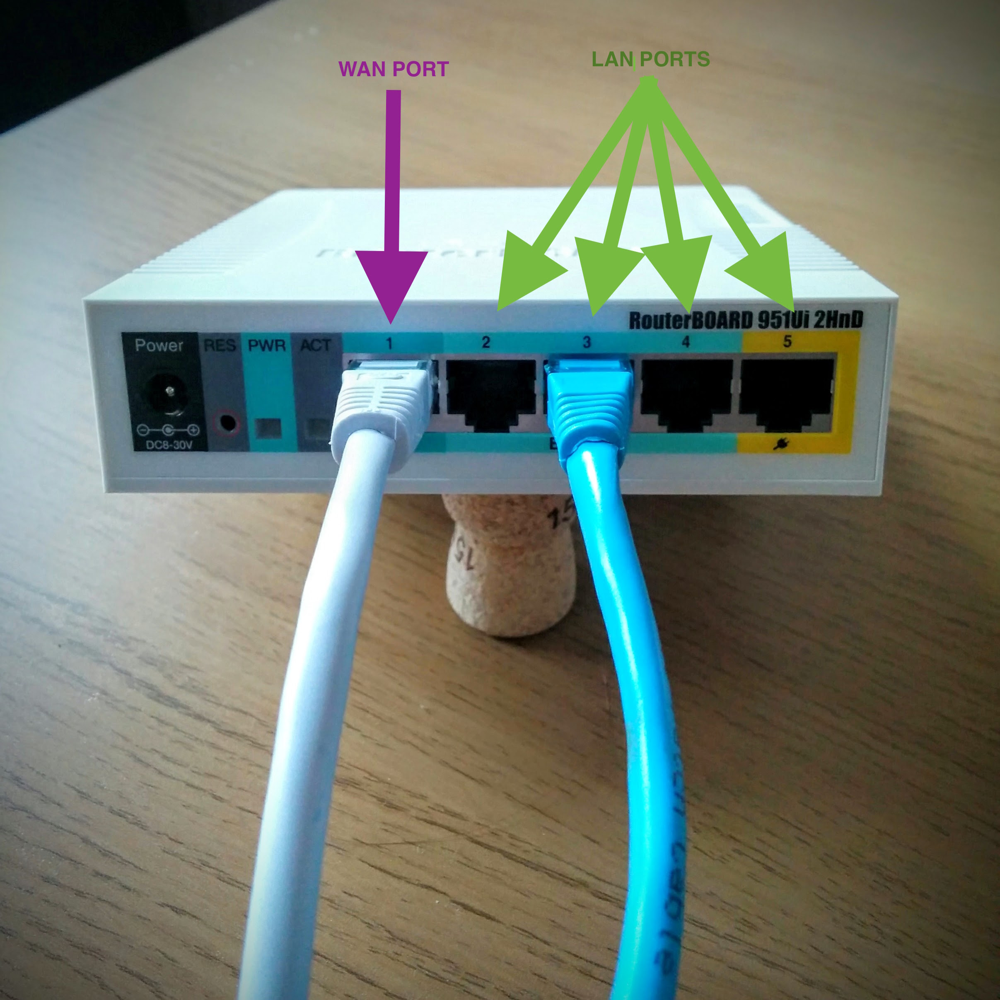
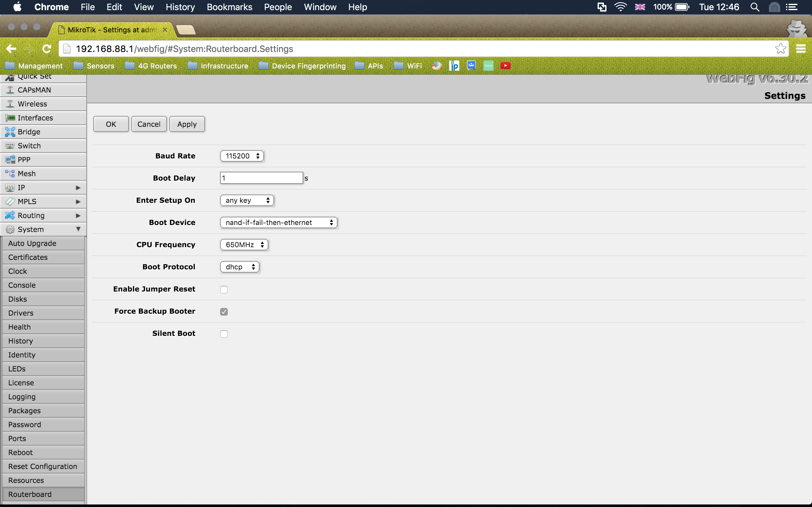
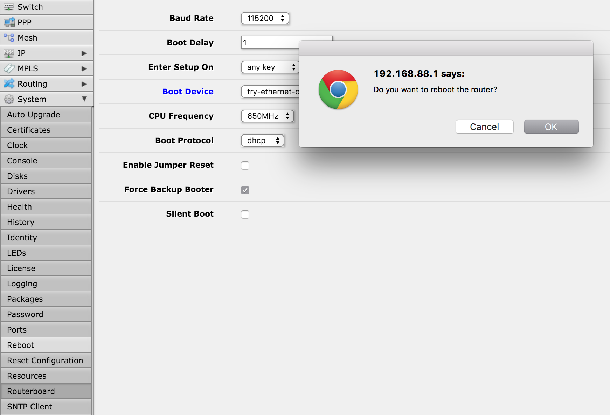

# Bootstrapping Mikrotik RB951 2HnD for OpenWRT

This Repository contains all the neccessary files and services to help speed up getting a Mikrotik RB951 2HnD device set up with OpenWRT on it. You don't have to use Vagrant for your control machine as the Ansible playbook will run on any Debian based machine.

Yes, I could have just baked all this into a vagrant box but I wanted it to be easy to update and educational (mainly for me!).

**Caveat:** All the terminal commands presume you are running a Unix based OS (Linux, OSX etc). If you are running Windows you can either:
  - [install cygwin](https://cygwin.com/install.html)
  - run from another VM (though Network Adapter forwarding could be a pain
  - Use Powershell alternatives

## Requirements

Before you begin bootstrapping your Mikrotik RB 951 2HnD you will need the following avaiable and/or installed on your Control Laptop

  - Mikrotik RB951 2HnD device (ensure it is not the hAP device) [This is the one we want](http://routerboard.com/RB951Ui-2HnD)
  - Control Laptop with either 2 x Ethernet adapters or a secondary laptop. I'm using a MBP with 2 x Thunderbolt-to-Ethernet Adapters. **(only one shown below)**
  - 2 x Ethernet cables
  - Ansible installed on Control Laptop (see [Installing Ansible](http://docs.ansible.com/ansible/intro_installation.html) )
  - Vagrant installed on Control Laptop (see [Installing Vagrant](https://www.vagrantup.com/docs/installation/) )
  - [This Repository](http://github.com/DavyJ0nes/OpenWRT-Mikrotik)


## Instructions

Here are the steps to get you set up. If you get into any trouble along the way then stop and rectify the error before continuing. If you see ay glaring errors then please make a PR and I will update the repo. ;)

### Part One - Getting Vagrant Virtually Envigorated

- First we need to bring the vagrant box online. This guide presumes that you already have Vagrant installed.
  - Open Vagrantfile and update the bridge adapter settings to your set up.
  - Run `vagrant up` within the root repository directory to bring the box up

- Once the box has come up, let's make sure you can ssh to it by running `vagrant ssh`

- Now let's check that Ansible can ssh to the vagrant box by running `Ansible config_machine -m ping` You should see the following return:

```Python
config_server | SUCCESS => {
    "changed": false,
    "ping": "pong"
}
```

- All good? Then let's run the playbook and get things configured:

```
ansible-playbook initial-setup.yml
```

- Once this has finished we now have all the relevant files and services running on our vagrant box, hurray!

### Part Two - Getting Physical

- Get Ethernet adapter sorted with Vagrant/Virtualbox

- Connect Control (Vagrant) adapter to WAN Port on device. The WAN port accepts DHCP and is used for preboot setup

- Connect secondary laptop or other Ethernet adapter to LAN Port on device. The LAN port issues DHCP addresses. You should receive an address within 192.168.88.x subnet (where x is a number between 2-253) when power is plugged in.


- Power on device by plugging in the power adapter.

### Part Three - NAND That's The End Of That Chapter

- From your Control machine run the bootloader script on the vagrant box by running `./start-bootloader.sh`. You can also run the go.sh script from this repo. In your terminal window you will see the output from dnsmasq. **Don't close this script**

- From your LAN connected machine/adapter go to http://192.168.88.1

- Now go to *System > Routerboard > Settings* menu


- Change the following options:
  - *Boot Device* = try-ethernet-once-then-nand
  - *Boot Protocol* = dhcp
  - *Force Backup Booter* = true(ticked)

- Click Apply and OK

- Then click *System > Reboot* and select OK


- The device should beep and red light should be on.

- From machine connected to LAN port check the issued IP address, it should now be in 192.168.1.x subnet.

- Confirm you can see the device by pinging 192.168.1.1.

### Part Four - Making it Permanent

We can back out of making the OpenWRT permenat by rebooting the device. It will then revert back to its deault Mikrotik firmware.

- Before continuing, stop the bootloader script

- Swap the Control machine's Ethernet cable from WAN to LAN port

- Check that you have been issued a new IP in the 192.168.1.x subnet. *Make a note of the IP that the Vagrant box has been given, we'll need it later.*

- Ping the device using `ping 192.168.1.1`

- Telnet to the device by using `telnet 192.168.1.1` (we have to use telnet because SSH isn't properly set up yet and we're not worried about security at the moment.)

- You should see the prompt `root@OpenWrt:/`

- Now check that the device can see the vagrant box by pinging the IP that the vagrant box was given. We can also check the IP from the device by running `cat /tmp/dhcp.leases`. This will output all the issued IP addresses and the related MAC addresses adn hostnames.

- Finally let's make this OpenWRT thing permenant. Run `wget2nand http://192.168.1.x` where x is the last octet of the vagrant box IP.

- Reboot the device

### That's It
